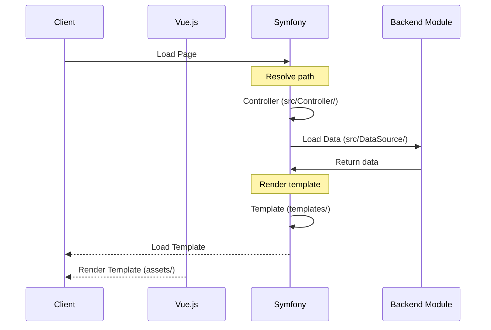

# Getting started

## With Docker

Requirements for developing are:

* [Docker](https://www.docker.com/)
* [Composer for PHP](https://getcomposer.org/)
* [Node](https://nodejs.org/en/)

In the `platform` directory, run the following command to install PHP and Node dependencies.

```
composer run-script first-run
docker-compose -f ../docker/docker-compose.yml up
```

Visiting [`http://0.0.0.0:8085`](http://0.0.0.0:8085) should load a simple overview page with a few links.

## With Minikube

Requirements for developing are:

* [Docker](https://www.docker.com/)
* [Minikube](https://minikube.sigs.k8s.io/docs/start/)
* [Skaffold](https://skaffold.dev/)

Before starting development locally docker has to be configured to talk to Minikube:
```
eval $(minikube -p minikube docker-env)
```
This configures the current shell to talk to Minikube instead of the local Docker daemon.

In the root of the project, run the following command to deploy to a local minikube (with automatic reloading):
```
skaffold dev
```

You should now be able to access http://boilerplate-fragment.testdomain/ (if you have configured DNS, see the wiki).

## Symfony environments locally and in Kustomize

### Structuring environment variables

There are many ways to organize environment variables. The boilerplate has the following structure:

| File | Use-case | Reasoning |
| ---- | -------- | --------- |
| `platform/.env` | All environments | Symfony- and package-specific values. These are used in **all** environments unless overridden. |
| `platform/.env.test` | PHPUnit tests | Symfony- and package-specific value overrides. Also contains extra key/values added by your fragment. |
| `platform/.env.local` | Local dev **without Minikube** (not commited) | Symfony- and package-specific value overrides. Also contains extra, local-specific, key/values added by your fragment. |
| `kustomize/overlays/local/patch-deployment-env-vars.yaml` | Local dev **with Minikube** (committed) | Symfony- and package-specific value overrides. Also contains extra, local-specific, key/values added by your fragment. |
| `kustomize/overlays/{environment}/patch-deployment-env-vars.yaml` | Deployed to a remote system | Symfony- and package-specific value overrides. Also contains extra, local-specific, key/values added by your fragment. |

### Using environment variables in Symfony

Your fragment will most likely need environment-specific values to do it's job properly.
Instead of using if-statements all over the place (if local dev, do X, etc...), we've opted
to adopt the Symfony recommendation to move those values out of the code.

Three ways to do this are:

1. Specify your value in multiple `.env`-files and/or as an environment variable in Kustomize.
2. Specify your value in multiple Symfony config files.
3. Combination of option 1 & 2.

Either way works.

Symfony config files can actually read your environment variables and have some additional functionality,
like [Variable Processors](https://symfony.com/doc/4.4/configuration/env_var_processors.html#built-in-environment-variable-processors).

**Example 1 (read raw environment values):**
```
// platform/.env.local
APP_ENV=local
BACKEND_SERVICE_URL=http://backend.local:1234

// kustomize/overlays/local/patch-deployment-env-vars.yaml
apiVersion: apps/v1
kind: Deployment
metadata:
  name: fragment
spec:
  template:
    spec:
      containers:
      - name: php
        env:
        - name: APP_ENV
          value: 'local'
        - name: BACKEND_SERVICE_URL
          value: 'http://backend.local:1234'

// platform/src/Controller/ExampleController.php
public function index() {
  $backendUrl = getenv('BACKEND_SERVICE_URL');
  $backendUrlAlternateVersion = $_SERVER['BACKEND_SERVICE_URL'];
}
```

**Example 2 (read from config-files per environment):**
```
// platform/.env.local
APP_ENV=local

// kustomize/overlays/local/patch-deployment-env-vars.yaml
apiVersion: apps/v1
kind: Deployment
metadata:
  name: fragment
spec:
  template:
    spec:
      containers:
      - name: php
        env:
        - name: APP_ENV
          value: 'local'

// platform/config/services_local.yaml
parameters:
  app.backend.url: 'http://backend.local:1234'

// platform/src/Controller/ExampleController.php
public function index() {
  $backendUrl = $this->params->get('app.backend.url');
  $backendUrlAlternateVersion = $this->getParameter('app.backend.url'); // if extending AbstractController
}
```

**Example 3 (combination of 1 & 2):**
```
// platform/.env.local
APP_ENV=local
BACKEND_SERVICE_URL=http://backend.local:1234

// kustomize/overlays/local/patch-deployment-env-vars.yaml
apiVersion: apps/v1
kind: Deployment
metadata:
  name: fragment
spec:
  template:
    spec:
      containers:
      - name: php
        env:
        - name: APP_ENV
          value: 'local'
        - name: BACKEND_SERVICE_URL
          value: 'http://backend.local:1234'

// platform/config/services_local.yaml
parameters:
  app.backend.url: '%env(BACKEND_SERVICE_URL)%'

// platform/src/Controller/ExampleController.php
public function index() {
  $backendUrl = $this->params->get('app.backend.url');
  $backendUrlAlternateVersion = $this->getParameter('app.backend.url'); // if extending AbstractController
}
```

### Optimise load times

The **Symfony Flex** package introduces a command for merging
and compiling .env-files into a single PHP-file (`.env.local.php`).
This will reduce Symfony bootup times (by ~7-13ms in local measurements) since
it bypasses the default behavior to always parse and merge .env files
on each request. You can compile the `.env.local.php`-file manually with
**Composer** inside the platform directory with: `composer dump-env local`.

This command will load, parse and merge `.env`, `.env.local` and
`.env.{environment}`, where `{environment}` is what you passed as parameter:
`composer dump-env {environment}`. The `{environment}` parameter will
also get set as `APP_ENV` inside `.env.local.php`.

*Note: Once `.env.local.php` has been compiled, changes to .env files will require you to re-run `composer dump-env local`.*

The boilerplate is setup to [**compile variables in .env-files**](https://symfony.com/doc/current/configuration.html#configuring-environment-variables-in-production)
into a static PHP-file (`.env.local.php`) *when it's PHP-container is started in Kubernetes*.
If this step fails the container will be seen by Kubernetes as failed and will not start.

### Adding new environments in Kustomize

For new environments you will need to create or modify
(non-environment stuff omitted - see other Kustomize guides for detils):

  - `kustomize/overlays/{new_environment}/patch-deployment-env-vars.yaml`
  - `kustomize/overlays/{new_environment}/kustomization.yaml`

If, for example, you need the `BACKEND_SERVICE_URL=example.com` for a `qa` environment,
you would have to:

1. Create the directory `kustomize/overlays/qa`.
2. Copy `kustomize/base/kustomization.yaml` > `kustomize/overlays/qa/kustomization.yaml`.
2. Copy `kustomize/base/patch-deployment-env-vars.yaml` > `kustomize/overlays/qa/patch-deployment-env-vars.yaml`.
3. Make below additions:

```
# overlays/qa/kustomization.yaml
patchesStrategicMerge:
    - patch-deployment-env-vars.yaml

# overlays/qa/patch-deployment-env-vars.yaml
apiVersion: apps/v1
kind: Deployment
metadata:
  name: fragment
spec:
  template:
    spec:
      containers:
      - name: php
        env:
        - name: APP_ENV
          value: 'local'
        - name: BACKEND_SERVICE_URL
          value: 'http://backend.local:1234'

```

## Fragment previewing

The fragment boilerplate is setup to support wrapping your fragment in a simple layout. This helps previewing your fragment in a browser with CSS and JS. To enable preview mode, add a query parameter to the fragment URL; `local_test=1`

## Testing

### PHP Tests

PHP tests are written for [PHPUnit](https://phpunit.de/) and are located in `platform/test`. These tests are executed with:

```
composer run-script test
```

### JavaScript Tests

Javascript tests are written for [Jest](https://facebook.github.io/jest/) and are located in the `assets` directory. Run these tests with:

```
npm run test
```

## Data flow


